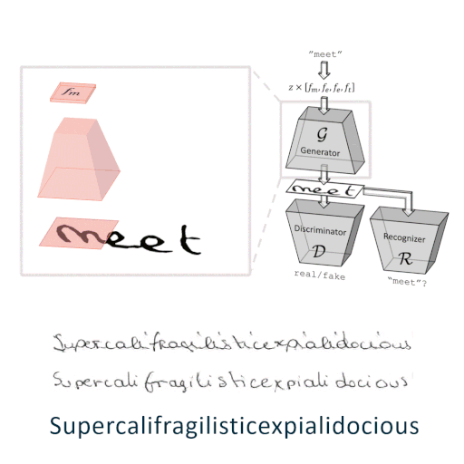

# ScrabbleStyleGAN: Semi-Supervised Varying Length Varying Style Handwritten Text Generation
this repo was initiality forked from ["ScrabbleGAN: Semi-Supervised Varying Length Handwritten Text Generation"](https://github.com/amzn/convolutional-handwriting-gan)



This is a pytorch implementation of the paper 
["ScrabbleGAN: Semi-Supervised Varying Length Handwritten Text Generation"](https://www.amazon.science/publications/scrabblegan-semi-supervised-varying-length-handwritten-text-generation)

### Added Features
- Supports autocast feature of PyTorch
- Generates style-varied handwriting based on given input style image
- Fixes subtential bugs both training
- More control when viewing the training process
### Dependency
- This work was tested with PyTorch ~~1.2.0, CUDA 9.0, python 3.6 and Ubuntu 16.04. ~~
- requirements can be found in the file environmentPytorch12.yml. The command to create the environment from the file is:
```conda env create --name pytorch1.2 --file=environmentPytorch12.yml```
- To activate the environment use:
```source activate pytorch1.2```

### Training

* To view the results during the training process, you need to set up a visdom port:
```visdom -port 8192```

#### Supervised Training
 ```
 python train.py --name_prefix demo --dataname RIMEScharH32W16 --capitalize --display_port 8192 
 ```
TODO - add the correct flags
* Main arguments:
    * `--name`: unless specified in the arguments, the experiment name is determined by the name_prefix, the dataset and parameters different from the default ones (see code in `options/base_options.py`).
    * `--name_prefix`: the prefix to the automatically generated experiment name.
    * `--dataname`: name of dataset which will determine the dataroot path according to data/dataset_catalog.py
    * `--lex`: the lexicon used to generate the fake images. There is a default lexicon for english/french data specified in `options/base_options.py`. 
    * `--capitalize`: randomly capitalize first letters of words in the lexicon used.
    * `--display_port`: visdom display port
    * `--checkpoints_dir`: the networks weights and sample images are saved to `checkpoints_dir/experiment_name`.
    * `--use_rnn`: whether to use LSTM
    * `--seed`: determine the seed for numpy and pytorch instead of using a random one.
    * `--gb_alpha`: the balance between the recognizer and discriminator loss. Higher alpha means larger weight for the recognizer.
* Other arguments are explained in the file `options/base_options.py` and `options/train_options.py`.

## License
ScrabbleGAN is released under the MIT license. See the [LICENSE](LICENSE) and [THIRD-PARTY-NOTICES.txt](THIRD-PARTY-NOTICES.txt) files for more information.
